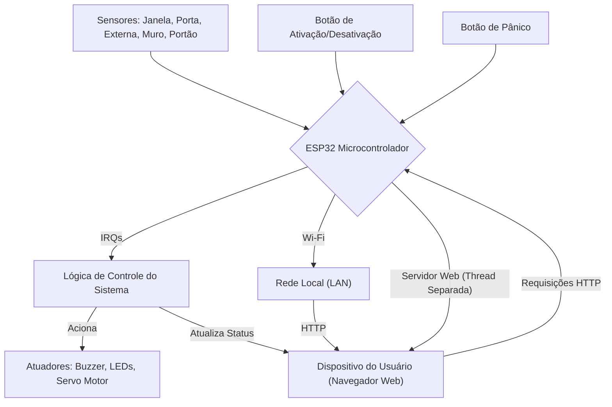

# Sistema de Segurança Residencial Inteligente

## 1. Introdução

Este documento apresenta uma análise aprofundada de um sistema de segurança residencial inteligente, desenvolvido com foco em acessibilidade e controle remoto. O projeto integra hardware e software para monitorar diversos pontos de entrada e condições ambientais, oferecendo uma solução robusta para a proteção patrimonial. A arquitetura do sistema é baseada em microcontroladores, especificamente o ESP32, devido à sua capacidade de processamento e conectividade Wi-Fi integrada, o que permite a criação de uma interface web para interação do usuário. O objetivo principal é fornecer uma compreensão detalhada do funcionamento do sistema, desde a inicialização dos componentes até a lógica de operação dos sensores, atuadores e a interface de usuário, com uma abordagem didática adequada para estudantes de nível superior em áreas como Engenharia de Computação, Engenharia Elétrica ou Ciência da Computação.


### 2. Funcionalidades

O sistema de segurança residencial inteligente oferece um conjunto abrangente de funcionalidades projetadas para garantir a proteção e o monitoramento eficaz de um ambiente. As principais funcionalidades incluem:

*   **Monitoramento de Múltiplos Sensores:** O sistema é capaz de monitorar o estado de cinco diferentes sensores, cada um associado a uma área específica da residência: janela, porta, área externa, muro e portão. Cada sensor é configurado para detectar movimentação ou abertura, acionando o sistema de alarme em caso de violação.

*   **Ativação/Desativação do Sistema:** Um botão físico dedicado permite ao usuário ativar ou desativar o sistema de segurança de forma manual. Esta funcionalidade é complementada por indicadores visuais (LEDs) que sinalizam o estado atual do sistema (ligado/desligado).

*   **Modo Pânico:** Em situações de emergência, um botão de pânico dedicado pode ser acionado para disparar imediatamente o alarme, independentemente do estado de ativação do sistema. Este modo é crucial para a segurança pessoal, permitindo uma resposta rápida a ameaças iminentes.

*   **Alarme Sonoro e Visual:** Quando um sensor é ativado ou o botão de pânico é pressionado, o sistema dispara um alarme que combina sinais sonoros (buzzer) e visuais (LEDs estroboscópicos). A intensidade e o padrão do alarme são projetados para alertar os ocupantes e dissuadir intrusos.

*   **Controle de Atuador (Servo Motor):** Um servo motor é integrado ao sistema para controlar um mecanismo de travamento ou destravamento, como uma fechadura eletrônica. Este atuador é acionado automaticamente quando o sistema é ativado ou desativado, proporcionando uma camada adicional de segurança.

*   **Interface Web Responsiva:** O sistema possui uma interface web embarcada, acessível via navegador, que permite ao usuário monitorar o status de todos os sensores em tempo real, verificar o estado de ativação do sistema e acionar o modo pânico remotamente. A interface é projetada para ser responsiva, adaptando-se a diferentes tamanhos de tela (desktops, tablets e smartphones).

*   **Conectividade Wi-Fi:** A comunicação entre o microcontrolador e a interface web é estabelecida via Wi-Fi, garantindo flexibilidade na instalação e acesso remoto ao sistema de qualquer dispositivo conectado à mesma rede.

*   **Tratamento de Repique (Debounce):** Para evitar leituras falsas de botões e sensores devido a ruídos elétricos ou mecânicos, o código implementa um mecanismo de *debounce* (tratamento de repique) para garantir a estabilidade e a precisão das entradas.

*   **Multithreading (Execução Paralela):** A utilização de *threads* permite que o servidor web opere em paralelo com a lógica principal do sistema, garantindo que a interface web permaneça responsiva e que o monitoramento dos sensores continue ininterruptamente.

Essas funcionalidades, em conjunto, formam um sistema de segurança robusto e interativo, capaz de oferecer tranquilidade e controle aos usuários.


### 3. Tecnologias Utilizadas

O desenvolvimento deste sistema de segurança residencial inteligente emprega uma combinação de hardware e software, selecionados por sua robustez, flexibilidade e adequação para aplicações embarcadas e de IoT. As principais tecnologias utilizadas são:

*   **MicroPython:** Uma implementação eficiente da linguagem de programação Python otimizada para microcontroladores e sistemas embarcados. MicroPython permite o desenvolvimento rápido e a prototipagem de hardware, oferecendo uma sintaxe familiar para programadores Python e acesso direto aos recursos de hardware do microcontrolador. Sua leveza e a capacidade de interagir diretamente com pinos GPIO, PWM e outras interfaces de hardware o tornam ideal para este tipo de projeto.

*   **ESP32:** Um microcontrolador de baixo custo e alto desempenho da Espressif Systems, conhecido por sua conectividade Wi-Fi e Bluetooth integrada. O ESP32 é a plataforma central deste sistema, responsável por processar as entradas dos sensores, controlar os atuadores e hospedar o servidor web. Sua capacidade de multithreading (via `_thread` em MicroPython) é fundamental para a execução paralela da lógica do sistema e do servidor web, garantindo a responsividade da interface do usuário sem comprometer o monitoramento em tempo real.

*   **HTML/CSS:** Utilizados para a construção da interface web do sistema. O HTML (HyperText Markup Language) define a estrutura e o conteúdo da página, enquanto o CSS (Cascading Style Sheets) é responsável pela estilização e pelo layout, garantindo que a interface seja visualmente atraente e responsiva em diferentes dispositivos. A escolha dessas tecnologias web padrão permite que a interface seja acessível através de qualquer navegador moderno, sem a necessidade de aplicativos adicionais.

*   **Protocolo HTTP (Hypertext Transfer Protocol):** A base para a comunicação entre o navegador do usuário e o servidor web embarcado no ESP32. O sistema utiliza requisições HTTP GET para receber comandos (como ativar/desativar o sistema ou o modo pânico) e para servir a página HTML com as informações de status atualizadas. A simplicidade do HTTP o torna adequado para aplicações embarcadas com recursos limitados.

*   **Sockets (Programação de Rede):** A camada de comunicação de baixo nível utilizada para estabelecer a conexão TCP/IP entre o servidor web no ESP32 e os clientes (navegadores). A biblioteca `socket` do MicroPython permite a criação de um servidor HTTP básico que escuta por conexões de entrada e envia respostas, formando a espinha dorsal da interface web.

*   **GPIO (General Purpose Input/Output):** Os pinos GPIO do ESP32 são utilizados para interagir com os componentes de hardware, como os LEDs (saídas digitais), os botões (entradas digitais com *pull-up* interno) e os sensores (entradas digitais). A capacidade de configurar esses pinos como entrada ou saída e de ler/escrever seus estados é fundamental para o funcionamento do sistema.

*   **PWM (Pulse Width Modulation):** Utilizado para controlar o servo motor e o buzzer. O PWM permite variar a largura do pulso de um sinal digital, o que, no caso do servo, controla sua posição angular, e no caso do buzzer, permite gerar diferentes frequências para criar tons de alarme variados. A biblioteca `machine.PWM` do MicroPython facilita a implementação dessa funcionalidade.

*   **Interrupções (IRQs):** Empregadas para detectar mudanças de estado nos pinos dos botões e sensores de forma eficiente. As IRQs permitem que o microcontrolador reaja instantaneamente a eventos externos sem a necessidade de *polling* contínuo, o que otimiza o uso da CPU e garante uma resposta rápida do sistema a qualquer acionamento. O tratamento de repique é implementado dentro dos *handlers* de interrupção para evitar acionamentos falsos.

Essas tecnologias, em conjunto, formam a base técnica para a construção de um sistema de segurança robusto, eficiente e de fácil interação.

  

### 4. Arquitetura do Sistema e Estrutura do Código

#### 4.1. Visão Geral

A arquitetura do sistema de segurança residencial inteligente é modular e distribuída, centrada no microcontrolador ESP32 como a unidade de processamento principal. Este design permite uma clara separação de responsabilidades e facilita a manutenção e futuras expansões. A comunicação entre os componentes físicos (sensores e atuadores) e a interface de usuário (via web) é gerenciada pelo ESP32, que atua como um servidor embarcado.

No nível mais fundamental, o sistema opera em um ciclo contínuo de monitoramento e resposta. Sensores digitais, configurados com resistores de *pull-up* internos para detecção de eventos (como abertura de portas/janelas ou detecção de movimento), estão conectados a pinos GPIO do ESP32. As mudanças de estado nesses pinos são detectadas por meio de interrupções (IRQs), garantindo uma resposta quase instantânea a qualquer violação. Essa abordagem baseada em interrupções é crucial para a eficiência, pois evita a necessidade de *polling* constante, liberando ciclos de CPU para outras tarefas.

Quando um sensor é ativado, a lógica de controle no ESP32 avalia o estado atual do sistema (ativado/desativado, modo pânico) e, se necessário, dispara o alarme. O alarme é composto por um atuador sonoro (buzzer, controlado via PWM para variar a frequência e intensidade) e atuadores visuais (LEDs, configurados para piscar em um padrão estroboscópico). Além disso, um servo motor, também controlado via PWM, é utilizado para um mecanismo de travamento/destravamento, adicionando uma camada física de segurança.

Paralelamente ao monitoramento de hardware, o ESP32 hospeda um servidor web minimalista. Este servidor é implementado utilizando a biblioteca `socket` do MicroPython e opera em uma *thread* separada, garantindo que a interface web permaneça responsiva mesmo durante o processamento de eventos de sensores. A interface web, construída com HTML e CSS, permite que os usuários visualizem o status de todos os sensores em tempo real, ativem/desativem o sistema e acionem o modo pânico remotamente. As interações na interface web são traduzidas em requisições HTTP GET que são processadas pelo servidor, que por sua vez invoca as funções de controle correspondentes no microcontrolador.

A conectividade Wi-Fi é o pilar da comunicação remota, permitindo que o ESP32 se conecte a uma rede local e seja acessível por qualquer dispositivo conectado a essa rede. A robustez do sistema é aprimorada pelo tratamento de *debounce* para todas as entradas de botão e sensor, prevenindo leituras falsas e garantindo a confiabilidade das detecções. A figura abaixo ilustra a arquitetura geral do sistema:



Esta arquitetura garante um sistema de segurança responsivo, interativo e de fácil gerenciamento, combinando a eficiência do hardware embarcado com a flexibilidade de uma interface baseada na web.


#### 4.2. Detalhamento dos Módulos e Funções

##### 4.2.1. Inicialização e Configuração

Esta seção do código é responsável por configurar o ambiente de execução, inicializar os periféricos de hardware e estabelecer as variáveis globais que controlarão o estado do sistema. A clareza e a organização nesta fase são cruciais para a estabilidade e previsibilidade do comportamento do sistema.

```python
#importações
from machine import PWM,Pin
from time import sleep_ms, ticks_ms, sleep
import network
import socket
import _thread

repique1 = 0
repique2 = 0
repique3 = 0
repique4 = 0
repique5 = 0
repativa = 0
reppanico = 0
repalarmeled3 = 0
repalarmeled4 = 0

led1 = Pin(15, Pin.OUT)
led1.value(0)
led2 = Pin(21, Pin.OUT)
led2.value(1)
led3 = Pin(22, Pin.OUT)
led4 = Pin(23, Pin.OUT)
bot1 = Pin(2, Pin.IN, Pin.PULL_UP)
bot2 = Pin(0, Pin.IN, Pin.PULL_UP)
bot3 = Pin(4, Pin.IN, Pin.PULL_UP)
bot4 = Pin(16, Pin.IN, Pin.PULL_UP)
bot5 = Pin(17, Pin.IN, Pin.PULL_UP)
botativa = Pin(18, Pin.IN, Pin.PULL_UP)
botpanico = Pin(19, Pin.IN, Pin.PULL_UP)
servo = PWM(Pin(13), freq=50)
verificacao = False
alarme = 0
modo = 2
som = PWM(Pin(12,Pin.OUT), freq=500, duty_u16=0)
i = 0
j = 0
```

**Análise Detalhada:**

1.  **Importações de Módulos:**
    *   `from machine import PWM, Pin`: Importa as classes `PWM` (Pulse Width Modulation) e `Pin` do módulo `machine`. A classe `Pin` é fundamental para configurar os pinos GPIO do ESP32 como entradas ou saídas digitais, enquanto `PWM` é utilizada para gerar sinais de largura de pulso variável, essenciais para controlar o servo motor e o buzzer. [1]
    *   `from time import sleep_ms, ticks_ms, sleep`: Importa funções relacionadas ao tempo do módulo `time`. `sleep_ms` e `sleep` são usadas para introduzir atrasos no código, e `ticks_ms` é crucial para a implementação do *debounce* (tratamento de repique), permitindo medir o tempo decorrido em milissegundos. [2]
    *   `import network`: Módulo para gerenciar a conectividade de rede (Wi-Fi) do ESP32. [3]
    *   `import socket`: Módulo para programação de rede de baixo nível, utilizado para criar o servidor web HTTP. [4]
    *   `import _thread`: Módulo para suporte a *multithreading*, permitindo a execução paralela de diferentes partes do código, como o servidor web e a lógica principal do sistema. [5]

2.  **Variáveis de Controle de Repique (Debounce):**
    *   `repique1` a `repique5`, `repativa`, `reppanico`, `repalarmeled3`, `repalarmeled4`: Estas variáveis globais são inicializadas com `0` e armazenarão o *timestamp* da última vez que um evento de botão ou sensor foi processado. Elas são a base para a implementação do algoritmo de *debounce* por software. O *debounce* é uma técnica essencial para evitar múltiplas detecções de um único acionamento físico de um botão ou sensor, que pode ocorrer devido a ruídos elétricos ou mecânicos (o 


efeito de 'repique'). Ao registrar o `ticks_ms()` no momento do último acionamento válido, o sistema pode ignorar acionamentos subsequentes dentro de um curto período (neste caso, 300ms ou 1000ms para o botão de pânico), garantindo que cada clique ou ativação seja interpretado como um único evento. [6]

3.  **Configuração dos Pinos GPIO (Entradas e Saídas):**
    *   `led1 = Pin(15, Pin.OUT)` e `led1.value(0)`: Configura o pino GPIO 15 como saída e o inicializa desligado. Este LED provavelmente indica o estado geral do sistema (ligado/desligado).
    *   `led2 = Pin(21, Pin.OUT)` e `led2.value(1)`: Configura o pino GPIO 21 como saída e o inicializa ligado. Este LED, em conjunto com o `led1`, pode formar um indicador visual do estado do sistema, talvez alternando ou complementando o `led1`.
    *   `led3 = Pin(22, Pin.OUT)` e `led4 = Pin(23, Pin.OUT)`: Configuram os pinos GPIO 22 e 23 como saídas. Estes LEDs são utilizados para o efeito estroboscópico do alarme visual, alternando entre si para criar um piscar rápido e chamativo.
    *   `bot1` a `bot5`, `botativa`, `botpanico`: Configuram os pinos GPIO 2, 0, 4, 16, 17, 18 e 19, respectivamente, como entradas digitais (`Pin.IN`). A opção `Pin.PULL_UP` ativa o resistor de *pull-up* interno do ESP32 para cada pino. Isso garante que o pino esteja em um estado lógico ALTO (HIGH) quando o botão não está pressionado, e vá para BAIXO (LOW) quando o botão é pressionado (configuração *active-low*). Esta é uma prática comum para evitar 


flutuações de sinal quando o botão está aberto, garantindo uma leitura estável. [7]

4.  **Configuração de Atuadores:**
    *   `servo = PWM(Pin(13), freq=50)`: Inicializa um objeto PWM no pino GPIO 13 com uma frequência de 50 Hz. Esta frequência é padrão para o controle da maioria dos servo motores, que esperam um pulso a cada 20 ms (1/50 Hz). O objeto `servo` será usado para controlar a posição angular de um servo motor, que pode ser empregado para travar/destravar um mecanismo. [8]
    *   `som = PWM(Pin(12,Pin.OUT), freq=500, duty_u16=0)`: Inicializa um objeto PWM no pino GPIO 12 (configurado como saída) com uma frequência inicial de 500 Hz e um *duty cycle* de 0. O *duty cycle* de 0 significa que o buzzer está inicialmente desligado. Este objeto `som` será utilizado para gerar os sons do alarme, permitindo variar a frequência para criar diferentes tons. [9]

5.  **Variáveis de Estado Globais:**
    *   `verificacao = False`: Variável booleana que indica o estado de ativação do sistema de segurança (`True` para ON, `False` para OFF). Inicialmente, o sistema está desativado.
    *   `alarme = 0`: Variável inteira que indica se o alarme está ativo (`1`) ou inativo (`0`).
    *   `modo = 2`: Variável que controla o modo de operação do alarme visual/sonoro. Os valores podem representar diferentes fases do ciclo de alarme (e.g., `0` para LED3 ligado, `1` para LED4 ligado, `2` para alarme inativo).
    *   `i = 0`, `j = 0`: Variáveis auxiliares, provavelmente utilizadas para contadores ou controle de loops dentro da lógica do alarme ou de outras funcionalidades. No contexto do alarme, `i` é usado para alternar a frequência do buzzer, criando um som mais dinâmico.

Esta seção de inicialização é fundamental, pois estabelece a base para todas as operações subsequentes do sistema, garantindo que todos os componentes de hardware estejam configurados corretamente e que as variáveis de estado estejam em seus valores iniciais esperados.


##### 4.2.2. Conectividade de Rede

A conectividade de rede é um pilar fundamental para este sistema de segurança, permitindo o controle e monitoramento remoto via interface web. Esta seção detalha a configuração do Wi-Fi e a inicialização do servidor web.

```python
#inicialização do servidor web via socket 
s = socket.socket(socket.AF_INET, socket.SOCK_STREAM)
s.setsockopt(socket.SOL_SOCKET, socket.SO_REUSEADDR, 1)
s.bind(("", 80))
s.listen(4)

# Variáveis para controle via website
status_janela = 0 #bot1
status_porta = 0 # #bot2
status_externa = 0 #bot3
status_muro = 0 #bot4
status_portao = 0 #bot5
# Controle do botão de ligar/desligar e de pânico
status_sistema = 0
panico_ativo = 0

def conectar_wifi(ssid, senha): # Conexão com o wi-fi
    print("Conectando-se ao Wi-Fi", end="")
    sta = network.WLAN(network.STA_IF)
    sta.active(True)
    sta.connect(ssid, senha)
    while not sta.isconnected():
        print(".", end="")
        sleep(0.1)
    print(" Conectado!")
    print("IP:", sta.ifconfig()[0])
    return sta

wlan = conectar_wifi("Wokwi-GUEST", "") ## Rede Wowki (Para Testes, substituir ou fazer prompt)

print("O Sistema pode ser ativado!")
```

**Análise Detalhada:**

1.  **Configuração do Servidor Socket:**
    *   `s = socket.socket(socket.AF_INET, socket.SOCK_STREAM)`: Cria um novo objeto socket. `socket.AF_INET` especifica a família de endereços IPv4, e `socket.SOCK_STREAM` indica que será um socket de fluxo (TCP), adequado para comunicação confiável e orientada a conexão, como o HTTP. [10]
    *   `s.setsockopt(socket.SOL_SOCKET, socket.SO_REUSEADDR, 1)`: Esta linha configura uma opção do socket. `SO_REUSEADDR` permite que o socket seja vinculado a um endereço local que já está em uso, o que é útil para evitar erros de "Address already in use" após o encerramento de um programa, especialmente durante o desenvolvimento e reinicialização rápida do ESP32. [11]
    *   `s.bind(("", 80))`: Vincula o socket a um endereço e porta específicos. O endereço vazio `""` significa que o servidor aceitará conexões de qualquer interface de rede disponível no ESP32. A porta `80` é a porta padrão para o protocolo HTTP, tornando o servidor acessível via navegador sem a necessidade de especificar a porta na URL. [12]
    *   `s.listen(4)`: Coloca o socket em modo de escuta para conexões de entrada. O argumento `4` define o número máximo de conexões pendentes que a fila pode conter. Isso significa que o servidor pode lidar com até 4 requisições de conexão simultaneamente antes de recusar novas. [13]

2.  **Variáveis de Status para Interface Web:**
    *   `status_janela`, `status_porta`, `status_externa`, `status_muro`, `status_portao`: Estas variáveis globais são inicializadas com `0` e serão atualizadas pela lógica dos sensores. Elas refletem o estado de cada sensor (ativado/desativado) e são utilizadas para exibir as informações correspondentes na interface web, proporcionando um feedback visual ao usuário sobre o estado de cada ponto de monitoramento.
    *   `status_sistema`: Inicializada com `0`, esta variável representa o estado geral do sistema de segurança (0 para desativado, 1 para ativado). É controlada pelo botão de ativação/desativação e refletida na interface web.
    *   `panico_ativo`: Inicializada com `0`, esta variável indica se o modo pânico está ativo (1) ou inativo (0). É controlada pelo botão de pânico e também exibida na interface web.

3.  **Função `conectar_wifi(ssid, senha)`:**
    *   Esta função é responsável por estabelecer a conexão Wi-Fi do ESP32 com uma rede local. Recebe o `ssid` (nome da rede) e a `senha` como argumentos.
    *   `sta = network.WLAN(network.STA_IF)`: Cria uma instância da interface WLAN no modo estação (`STA_IF`), que permite ao ESP32 se conectar a um ponto de acesso Wi-Fi existente.
    *   `sta.active(True)`: Ativa a interface Wi-Fi.
    *   `sta.connect(ssid, senha)`: Inicia o processo de conexão à rede Wi-Fi especificada.
    *   `while not sta.isconnected():`: Um loop de espera que verifica continuamente o status da conexão. Enquanto o ESP32 não estiver conectado, ele imprime um ponto `.` a cada 100 milissegundos (`sleep(0.1)`), fornecendo um feedback visual do processo de conexão.
    *   `print(" Conectado!")` e `print("IP:", sta.ifconfig()[0])`: Após a conexão bem-sucedida, imprime uma mensagem de sucesso e o endereço IP atribuído ao ESP32 na rede, que será essencial para acessar a interface web.
    *   `return sta`: Retorna o objeto da interface WLAN conectada.

4.  **Conexão Wi-Fi e Mensagem Inicial:**
    *   `wlan = conectar_wifi("Wokwi-GUEST", "")`: Chama a função `conectar_wifi` para conectar o ESP32 à rede "Wokwi-GUEST" sem senha. Esta é uma configuração comum para ambientes de teste como o Wokwi. Em um ambiente de produção, o SSID e a senha devem ser configurados de forma segura, talvez lidos de um arquivo de configuração ou de variáveis de ambiente.
    *   `print("O Sistema pode ser ativado!")`: Uma mensagem de console que indica que o ESP32 foi inicializado e está pronto para operar, aguardando a ativação do sistema de segurança.

Esta seção garante que o ESP32 esteja conectado à rede e que o servidor web esteja pronto para aceitar requisições, estabelecendo a base para a interação remota com o sistema.


##### 4.2.3. Controle de Sensores e Atuadores

Esta seção aborda as funções responsáveis por interagir com os sensores (botões) e os atuadores (servo motor), incluindo a crucial implementação do *debounce* para garantir a confiabilidade das leituras.

```python
def mover_servo(angulo): # Calcula o movimento do servo (Travado/Destravado)
    duty = int((angulo / 180) * 75 + 40)
    servo.duty(duty)

def bot1ativo (pino): #Controle do botão 1

    global modo
    global alarme
    global verificacao
    global repique1
    global status_janela
    
    if(((ticks_ms() - repique1) > 300) and verificacao == True):
        print("O sensor da janela foi ativado! Cuidado")
        status_janela = 1
        alarme = 1
        repique1 = ticks_ms()
        print(status_janela)
        if(led3.value() == 0 and led4.value() == 0):
            modo = 0
            status_janela = 0
    

def bot2ativo(pino): #Controle do botão 2

    global modo 
    global alarme
    global verificacao
    global repique2
    global status_porta


    if(((ticks_ms() - repique2) > 300) and verificacao == True):
        print("O sensor da porta foi ativado! Cuidado")
        status_porta = 1
        alarme = 1
        repique2 = ticks_ms()
        if(led3.value() == 0 and led4.value() == 0):
            modo = 0
            status_porta = 0
    

def bot3ativo(pino): #Controle do botão 3

    global modo
    global alarme
    global verificacao
    global repique3
    global status_externa


    if(((ticks_ms() - repique3) > 300) and verificacao == True):
        print("O sensor da área externa foi ativado! Cuidado")
        status_externa = 1
        alarme = 1
        repique3 = ticks_ms()
        if(led3.value() == 0 and led4.value() == 0):
            modo = 0
            status_externa = 0

def bot4ativo(pino): #Controle do botão 4

    global modo
    global alarme
    global verificacao
    global repique4
    global status_muro

    if(((ticks_ms() - repique4) > 300) and verificacao == True):
        print("O sensor do muro foi ativado! Cuidado")
        status_muro = 1
        alarme = 1
        repique4 = ticks_ms()
        if(led3.value() == 0 and led4.value() == 0):
            modo = 0
            status_muro = 0

def bot5ativo(pino): #Controle do botão 5

    global modo
    global alarme
    global verificacao
    global repique5
    global status_portao

    if(((ticks_ms() - repique5) > 300) and verificacao == True):
        print("O sensor do portão foi ativado! Cuidado")
        status_portao = 1
        alarme = 1
        repique5 = ticks_ms()
        if(led3.value() == 0 and led4.value() == 0):
            modo = 0
            status_portao = 0

def apertoubotaoativa(pino): #Controle do botão de ativação

    global verificacao
    global repativa
    global status_sistema

    if((ticks_ms() - repativa) > 300):
        verificacao = not verificacao
        led1.value(not led1.value())
        led2.value(not led2.value())
        if(verificacao==True):
            print("Sistema de segurança ON")
            mover_servo(0)
            status_sistema = 1
        if(verificacao==False):
            print("Sistema de segurançao OFF")
            mover_servo(90)
            status_sistema = 0
        repativa = ticks_ms()

def apertoubotaopanico(pino): #Controle do botão de pânico
    global verificacao, alarme, modo, reppanico, panico_ativo, ldpanico

    if ((ticks_ms() - reppanico) > 1000) and verificacao:
        panico_ativo = not panico_ativo  # alterna o estado (liga/desliga)

        if panico_ativo:
            print("Botão de pânico ON")
            alarme = 1
            modo = 0
            ldpanico = 1
        else:
            print("Botão de pânico OFF")
            alarme = 0
            modo = 2
            ldpanico = 0
            led3.value(0)
            led4.value(0)
            som.duty_u16(0)
            panico_ativo = 0

        reppanico = ticks_ms()
```

**Análise Detalhada:**

1.  **Função `mover_servo(angulo)`:**
    *   Esta função é responsável por controlar a posição angular do servo motor. Servo motores são atuadores que permitem um controle preciso de posição, geralmente variando de 0 a 180 graus.
    *   `duty = int((angulo / 180) * 75 + 40)`: Esta é a fórmula de mapeamento que converte um ângulo em graus (0-180) para um valor de *duty cycle* (ciclo de trabalho) que o servo motor entende. Para um servo motor padrão, um pulso de 1ms (5% de *duty cycle* para 50Hz) geralmente corresponde a 0 graus, e um pulso de 2ms (10% de *duty cycle* para 50Hz) corresponde a 180 graus. A fórmula `(angulo / 180) * 75 + 40` ajusta esses valores para a faixa específica de *duty cycle* esperada pelo servo conectado ao ESP32, onde `75` e `40` são valores calibrados para o servo em questão. O valor `75` representa a amplitude do *duty cycle* e `40` o offset mínimo. O resultado é convertido para inteiro, pois o método `duty()` espera um valor inteiro. [14]
    *   `servo.duty(duty)`: Aplica o *duty cycle* calculado ao pino PWM configurado para o servo, movendo-o para a posição angular desejada.

2.  **Funções `botXativo(pino)` (para `bot1` a `bot5`):**
    *   Estas cinco funções (`bot1ativo`, `bot2ativo`, `bot3ativo`, `bot4ativo`, `bot5ativo`) são *handlers* de interrupção (ISR - Interrupt Service Routine) para os respectivos sensores (janela, porta, área externa, muro, portão). Elas são chamadas automaticamente quando o estado do pino associado muda (neste caso, na borda de descida, `Pin.IRQ_FALLING`, indicando que o botão foi pressionado ou o sensor ativado).
    *   `global modo, alarme, verificacao, repiqueX, status_Y`: Declara as variáveis globais que serão modificadas dentro da função. É crucial usar `global` para que as alterações feitas dentro da ISR afetem as variáveis no escopo principal do programa.
    *   `if(((ticks_ms() - repiqueX) > 300) and verificacao == True):`: Esta é a implementação do *debounce* para os sensores. Ele verifica duas condições:
        *   `ticks_ms() - repiqueX > 300`: Garante que pelo menos 300 milissegundos se passaram desde a última vez que este sensor foi ativado e processado. Isso evita múltiplas detecções devido a ruídos elétricos ou mecânicos (repique do botão/sensor). [6]
        *   `verificacao == True`: Garante que o sistema de segurança esteja ativado (`ON`). Se o sistema estiver desativado, a ativação de um sensor não disparará o alarme, mas o status do sensor ainda será atualizado na interface web.
    *   `print("O sensor da [nome do sensor] foi ativado! Cuidado")`: Mensagem de depuração no console indicando qual sensor foi ativado.
    *   `status_Y = 1`: Atualiza a variável de status correspondente ao sensor para `1`, indicando que ele está ativado. Esta variável será usada para exibir o status na interface web.
    *   `alarme = 1`: Define a variável global `alarme` como `1`, sinalizando que uma condição de alarme foi detectada e que a lógica de alarme principal deve ser acionada.
    *   `repiqueX = ticks_ms()`: Atualiza o *timestamp* do último acionamento válido para este sensor, reiniciando o temporizador de *debounce*.
    *   `if(led3.value() == 0 and led4.value() == 0): modo = 0; status_Y = 0`: Esta condição parece ser uma tentativa de resetar o `modo` e o `status_Y` se os LEDs de alarme estiverem desligados. No entanto, a lógica de `status_Y = 0` dentro desta condição pode causar um comportamento inesperado, pois um sensor ativado não deveria ser resetado para `0` automaticamente enquanto o alarme não for desativado ou o sistema rearmado. Isso pode ser um ponto de melhoria ou uma lógica específica para um cenário particular de reset manual do alarme.

3.  **Função `apertoubotaoativa(pino)`:**
    *   Esta função é o *handler* de interrupção para o botão de ativação/desativação do sistema.
    *   `global verificacao, repativa, status_sistema`: Declara as variáveis globais que serão modificadas.
    *   `if((ticks_ms() - repativa) > 300):`: Implementa o *debounce* para o botão de ativação, com um atraso de 300ms.
    *   `verificacao = not verificacao`: Alterna o estado da variável `verificacao` (de `True` para `False` ou vice-versa), ativando ou desativando o sistema.
    *   `led1.value(not led1.value())` e `led2.value(not led2.value())`: Alterna o estado dos LEDs indicadores `led1` e `led2`, fornecendo feedback visual sobre o estado de ativação do sistema.
    *   `if(verificacao==True): ... mover_servo(0); status_sistema = 1`: Se o sistema for ativado, imprime uma mensagem, move o servo para a posição `0` (provavelmente travado) e atualiza `status_sistema` para `1`.
    *   `if(verificacao==False): ... mover_servo(90); status_sistema = 0`: Se o sistema for desativado, imprime uma mensagem, move o servo para a posição `90` (provavelmente destravado) e atualiza `status_sistema` para `0`.
    *   `repativa = ticks_ms()`: Atualiza o *timestamp* do último acionamento válido para o botão de ativação.

4.  **Função `apertoubotaopanico(pino)`:**
    *   Esta função é o *handler* de interrupção para o botão de pânico.
    *   `global verificacao, alarme, modo, reppanico, panico_ativo, ldpanico`: Declara as variáveis globais que serão modificadas.
    *   `if ((ticks_ms() - reppanico) > 1000) and verificacao:`: Implementa o *debounce* para o botão de pânico, com um atraso maior de 1000ms (1 segundo), para evitar acionamentos acidentais. A condição `verificacao` garante que o botão de pânico só funcione se o sistema estiver ativado.
    *   `panico_ativo = not panico_ativo`: Alterna o estado da variável `panico_ativo` (liga/desliga o modo pânico).
    *   Se `panico_ativo` for `True`: Imprime mensagem, define `alarme = 1` e `modo = 0` (para iniciar o alarme visual/sonoro), e `ldpanico = 1` (variável não utilizada no código fornecido, pode ser um resquício ou para uso futuro).
    *   Se `panico_ativo` for `False`: Imprime mensagem, desativa o alarme (`alarme = 0`, `modo = 2`), desliga os LEDs de alarme (`led3.value(0)`, `led4.value(0)`), desliga o som (`som.duty_u16(0)`) e reseta `panico_ativo` para `0`.
    *   `reppanico = ticks_ms()`: Atualiza o *timestamp* do último acionamento válido para o botão de pânico.

Essas funções são o cerne da interação do sistema com o ambiente físico, traduzindo eventos de hardware em ações lógicas e controlando os atuadores de forma responsiva e confiável, graças à implementação cuidadosa do *debounce* e do uso de interrupções. [15]


##### 4.2.4. Lógica de Alarme e Pânico

Esta seção descreve a implementação da lógica principal do alarme, que é ativada por sensores ou pelo botão de pânico, e como os atuadores (LEDs e buzzer) são controlados para sinalizar a ocorrência de uma intrusão ou emergência.

```python
# Faz o sistema do buzzer e dos leds do Estrobo e do led de ativação
while True:
    if((alarme == 1) and verificacao == True):
        if((ticks_ms() - repalarmeled3 > 300) and modo == 0):
            led3.value(1)
            led4.value(0)
            som.duty_u16(0)
            modo = 1
            repalarmeled4 = ticks_ms()
        if((ticks_ms() - repalarmeled4 > 300) and modo == 1):
            i+=1
            led3.value(0)
            led4.value(1)
            som.duty_u16(512)
            if(i%2 == 0):
                som.freq(300)
            else:
                som.freq(250)
            repalarmeled3 = ticks_ms()
            modo=0
    else :
        led3.value(0)
        led4.value(0)
        alarme = 0
        modo=2
        som.duty_u16(0)
```

**Análise Detalhada:**

1.  **Loop Principal (`while True`):**
    *   O código dentro deste `while True` é executado continuamente no *loop* principal do MicroPython. É aqui que a lógica de ativação do alarme é constantemente verificada e os atuadores são controlados.

2.  **Condição de Alarme Ativo:**
    *   `if((alarme == 1) and verificacao == True):`: Esta é a condição primária para que o alarme seja disparado. Ela verifica se a variável global `alarme` é `1` (indicando que um sensor foi ativado ou o botão de pânico foi pressionado) E se o sistema de segurança está `verificacao == True` (ou seja, o sistema está ativado). Se ambas as condições forem verdadeiras, o sistema entra no modo de alarme.

3.  **Lógica de Flashing dos LEDs e Som do Buzzer (Modo Estroboscópico):**
    *   `if((ticks_ms() - repalarmeled3 > 300) and modo == 0):`:
        *   Esta condição controla a primeira fase do efeito estroboscópico. Ela verifica se 300 milissegundos se passaram desde a última atualização do `repalarmeled3` (garantindo um tempo mínimo para o *flash*) E se o `modo` atual é `0`.
        *   `led3.value(1)`: Liga o `led3`.
        *   `led4.value(0)`: Garante que o `led4` esteja desligado.
        *   `som.duty_u16(0)`: Desliga o som do buzzer nesta fase, criando um efeito de 


silêncio momentâneo entre os *flashes*.
        *   `modo = 1`: Transiciona o `modo` para `1`, preparando para a próxima fase do ciclo estroboscópico.
        *   `repalarmeled4 = ticks_ms()`: Atualiza o *timestamp* para o próximo ciclo de `led4`.
    *   `if((ticks_ms() - repalarmeled4 > 300) and modo == 1):`:
        *   Esta condição controla a segunda fase do efeito estroboscópico. Ela verifica se 300 milissegundos se passaram desde a última atualização do `repalarmeled4` E se o `modo` atual é `1`.
        *   `i+=1`: Incrementa a variável `i`. Esta variável é usada para alternar a frequência do buzzer, criando um som mais dinâmico e perceptível.
        *   `led3.value(0)`: Garante que o `led3` esteja desligado.
        *   `led4.value(1)`: Liga o `led4`.
        *   `som.duty_u16(512)`: Ativa o som do buzzer com um *duty cycle* de 512 (de um máximo de 1023 para `duty_u16`), produzindo um som audível.
        *   `if(i%2 == 0): som.freq(300) else: som.freq(250)`: Alterna a frequência do buzzer entre 300 Hz e 250 Hz a cada ciclo, criando um efeito de sirene ou alarme intermitente. [9]
        *   `repalarmeled3 = ticks_ms()`: Atualiza o *timestamp* para o próximo ciclo de `led3`.
        *   `modo=0`: Transiciona o `modo` de volta para `0`, completando o ciclo estroboscópico e preparando para o próximo *flash*.

4.  **Condição de Alarme Inativo (`else`):**
    *   `else:`: Este bloco é executado quando a condição principal `((alarme == 1) and verificacao == True)` é falsa, ou seja, quando o alarme não está ativo ou o sistema está desativado.
    *   `led3.value(0)` e `led4.value(0)`: Desliga ambos os LEDs de alarme, garantindo que não haja indicação visual de alarme.
    *   `alarme = 0`: Reseta a variável `alarme` para `0`, indicando que não há alarme ativo.
    *   `modo=2`: Reseta o `modo` para `2`, um estado neutro que indica que o alarme está inativo e pronto para ser acionado novamente.
    *   `som.duty_u16(0)`: Desliga completamente o som do buzzer.

Esta lógica de alarme é projetada para ser visual e audivelmente impactante, utilizando um padrão estroboscópico com LEDs e um som de sirene alternado para maximizar a atenção e a dissuasão. A gestão do `modo` e dos *timestamps* de repique garante um controle preciso do tempo e da sequência dos efeitos do alarme. [15]


##### 4.2.5. Interface Web

A interface web é um componente crucial do sistema, permitindo que o usuário monitore o status dos sensores e controle o sistema remotamente através de um navegador. Esta seção detalha a função que gera a página HTML e a função que gerencia as requisições HTTP.


```python
def pagina(): # Função que define as variaveis para serem usadas para controle da pagina e o html da página
    global status_muro, status_janela, status_porta, status_sistema, status_externa, panico_ativo, status_portao
    
    status_acionamento_text = "Ativado" if status_sistema == 1 else "Desativado"
    status_panico_text = "Modo pânico ligado" if panico_ativo == 1 else "Modo pânico desligado"
    
    status_bot1_text = "Sensor da Janela ativado!" if status_janela == 1 else "Sem movimentação"
    status_bot2_text = "Sensor da Porta ativado!" if status_porta == 1 else "Sem movimentação"
    status_bot3_text = "Sensor da Área Externa ativado!" if status_externa == 1 else "Sem movimentação"
    status_bot4_text = "Sensor do Muro ativado!" if status_muro == 1 else "Sem movimentação"
    status_bot5_text = "Sensor do Portão ativado!" if status_portao == 1 else "Sem movimentação"
    
    html = f"""
<html>
<head>
    <title>Sistema de Segurança</title>
    <meta http-equiv="Content-Type" content="text/html; charset=utf-8">
    <meta name="viewport" content="width=device-width, initial-scale=1.0">
    <link rel="icon" href="data:,">
    <link href="https://fonts.googleapis.com/css2?family=Inter:wght@300;400;500;600;700&display=swap" rel="stylesheet">
    <style>
        * {{
            margin: 0;
            padding: 0;
            box-sizing: border-box;
        }}
        
        body {{
            font-family: 'Inter', sans-serif;
            background: linear-gradient(135deg, #667eea 0%, #764ba2 100%);
            min-height: 100vh;
            padding: 20px;
            color: #333;
        }}
        
        .container {{
            max-width: 800px;
            margin: 0 auto;
        }}
        
        h1 {{
            color: white;
            text-align: center;
            font-size: 2.5rem;
            font-weight: 700;
            margin-bottom: 30px;
            text-shadow: 0 2px 10px rgba(0,0,0,0.3);
            animation: fadeInDown 0.8s ease-out;
        }}
        
        .status-card {{
            background: rgba(255, 255, 255, 0.95);
            backdrop-filter: blur(10px);
            border-radius: 20px;
            padding: 30px;
            margin: 20px 0;
            box-shadow: 0 20px 40px rgba(0,0,0,0.1);
            border: 1px solid rgba(255,255,255,0.2);
            animation: fadeInUp 0.8s ease-out;
            transition: transform 0.3s ease, box-shadow 0.3s ease;
        }}
        
        .status-card:hover {{
            transform: translateY(-5px);
            box-shadow: 0 25px 50px rgba(0,0,0,0.15);
        }}
        
        .status-grid {{
            display: grid;
            grid-template-columns: repeat(auto-fit, minmax(200px, 1fr));
            gap: 15px;
            margin: 20px 0;
        }}
        
        .status-item {{
            background: linear-gradient(135deg, #f8f9ff 0%, #e8f0ff 100%);
            padding: 15px;
            border-radius: 12px;
            border-left: 4px solid #4CAF50;
            transition: all 0.3s ease;
        }}
        
        .status-item:hover {{
            transform: scale(1.02);
            box-shadow: 0 5px 15px rgba(0,0,0,0.1);
        }}
        
        .status-text {{
            font-size: 1.1rem;
            font-weight: 500;
            margin: 0;
        }}
        
        .main-status {{
            text-align: center;
            margin-bottom: 25px;
        }}
        
        .main-status p {{
            font-size: 1.3rem;
            font-weight: 600;
            margin: 10px 0;
        }}
        
        .divider {{
            height: 2px;
            background: linear-gradient(90deg, transparent, #ddd, transparent);
            margin: 25px 0;
            border: none;
        }}
        
        .controls {{
            display: flex;
            justify-content: center;
            gap: 20px;
            flex-wrap: wrap;
            margin-top: 30px;
        }}
        
        .btn {{
            background: linear-gradient(135deg, #4CAF50 0%, #45a049 100%);
            color: white;
            border: none;
            border-radius: 15px;
            padding: 18px 35px;
            font-size: 1.1rem;
            font-weight: 600;
            cursor: pointer;
            transition: all 0.3s ease;
            text-decoration: none;
            display: inline-block;
            box-shadow: 0 8px 25px rgba(76, 175, 80, 0.3);
            position: relative;
            overflow: hidden;
        }}
        
        .btn::before {{
            content: '';
            position: absolute;
            top: 0;
            left: -100%;
            width: 100%;
            height: 100%;
            background: linear-gradient(90deg, transparent, rgba(255,255,255,0.2), transparent);
            transition: left 0.5s;
        }}
        
        .btn:hover::before {{
            left: 100%;
        }}
        
        .btn:hover {{
            transform: translateY(-3px);
            box-shadow: 0 12px 35px rgba(76, 175, 80, 0.4);
        }}
        
        .btn:active {{
            transform: translateY(-1px);
        }}
        
        .btn-panic {{
            background: linear-gradient(135deg, #f44336 0%, #d32f2f 100%);
            box-shadow: 0 8px 25px rgba(244, 67, 54, 0.3);
        }}
        
        .btn-panic:hover {{
            box-shadow: 0 12px 35px rgba(244, 67, 54, 0.4);
        }}
        
        .footer {{
            text-align: center;
            margin-top: 40px;
            padding: 20px;
            background: rgba(255, 255, 255, 0.1);
            backdrop-filter: blur(10px);
            border-radius: 15px;
            color: white;
            font-weight: 500;
            animation: fadeIn 1s ease-out 0.5s both;
        }}
        
        @keyframes fadeInDown {{
            from {{
                opacity: 0;
                transform: translateY(-30px);
            }}
            to {{
                opacity: 1;
                transform: translateY(0);
            }}
        }}
        
        @keyframes fadeInUp {{
            from {{
                opacity: 0;
                transform: translateY(30px);
            }}
            to {{
                opacity: 1;
                transform: translateY(0);
            }}
        }}
        
        @keyframes fadeIn {{
            from {{
                opacity: 0;
            }}
            to {{
                opacity: 1;
            }}
        }}
        
        @media (max-width: 768px) {{
            h1 {{
                font-size: 2rem;
            }}
            
            .status-card {{
                padding: 20px;
                margin: 15px 0;
            }}
            
            .controls {{
                flex-direction: column;
                align-items: center;
            }}
            
            .btn {{
                width: 100%;
                max-width: 300px;
            }}
        }}
    </style>
</head>
<body>
    <div class="container">
        <h1>🔐 Sistema de Segurança</h1>

        <div class="status-card">
            <div class="main-status">
                <p>🟢 <strong>Status do sistema:</strong> {status_acionamento_text}</p>
                <p>🚨 <strong>Status do pânico:</strong> {status_panico_text}</p>
            </div>
            
            <hr class="divider">
            
            <div class="status-grid">
                <div class="status-item">
                    <p class="status-text">🪟 <strong>Janela:</strong> {status_bot1_text}</p>
                </div>
                <div class="status-item">
                    <p class="status-text">🧱 <strong>Muro:</strong> {status_bot4_text}</p>
                </div>
                <div class="status-item">
                    <p class="status-text">📡 <strong>Área externa:</strong> {status_bot3_text}</p>
                </div>
                <div class="status-item">
                    <p class="status-text">🚪 <strong>Porta:</strong> {status_bot2_text}</p>
                </div>
                <div class="status-item">
                    <p class="status-text">🛡️ <strong>Portão:</strong> {status_bot5_text}</p>
                </div>
            </div>
        </div>

        <div class="status-card">
            <div class="controls">
                <a href="/?toggle_sistema" class="btn">
                    ⚡ Alternar Sistema
                </a>
                <a href="/?toggle_panico" class="btn btn-panic">
                    🚨 Alternar Pânico
                </a>
            </div>
        </div>
        
        <div class="footer">
            <p><strong>Feito por:</strong> Paulo Lima, Gysele Torga, Lays Paula, Natanael Lima Neto</p>
        </div>
    </div>
</body>
</html>
    """
    return html

def website(): # Função que escuta os requests e ultiliza as funções de ligar o sistema e botão de pânico

    while True:
        global s 
        conexao, endereco = s.accept()
        print(f'Conexão recebida de {str(endereco)}')
        request = conexao.recv(1024)
        request = str(request)
        print(f'Solicitação recebida: {request}')
    
        if '/?toggle_sistema' in request:
            apertoubotaoativa(None)
        if '/?toggle_panico' in request:
            apertoubotaopanico(None)

_thread.start_new_thread(website, ()) #Inicia o site paralelamente com o resto do código 
```

**Análise Detalhada:**

1.  **Função `pagina()`:**
    *   Esta função é responsável por gerar o conteúdo HTML da interface web. Ela dinamicamente insere os estados atuais do sistema e dos sensores na página, garantindo que o usuário sempre veja informações atualizadas.
    *   `global status_muro, ... status_portao`: Declara as variáveis globais de status que serão lidas para construir a página. Essas variáveis são atualizadas pelas funções de *handler* dos sensores e botões.
    *   `status_acionamento_text = "Ativado" if status_sistema == 1 else "Desativado"`: Utiliza uma expressão condicional (*ternary operator*) para converter o valor numérico de `status_sistema` (0 ou 1) em uma string legível ("Ativado" ou "Desativado"). O mesmo padrão é aplicado para `status_panico_text` e para os textos de status de cada sensor (`status_botX_text`). Esta é uma prática de programação limpa e eficiente para mapear estados numéricos para representações textuais.
    *   `html = f"""..."""`: Define uma *f-string* multilinha que contém todo o código HTML e CSS da página. As *f-strings* permitem a fácil interpolação de variáveis Python diretamente no texto, o que é utilizado aqui para inserir os `status_X_text` gerados anteriormente. [16]
    *   **Estrutura HTML e Estilização CSS:**
        *   A página inclui metadados para `Content-Type` (UTF-8 para suporte a caracteres especiais) e `viewport` (para responsividade em dispositivos móveis). [17]
        *   Um link para a fonte 'Inter' do Google Fonts é incluído, conferindo um design moderno à interface. [18]
        *   O bloco `<style>` contém o CSS que define a aparência da página. Ele utiliza técnicas de design responsivo (`@media (max-width: 768px)`) para adaptar o layout a diferentes tamanhos de tela, garantindo uma boa experiência de usuário em smartphones e tablets. O design é moderno, com gradientes, sombras e animações (`fadeInDown`, `fadeInUp`, `fadeIn`), que melhoram a experiência visual. [19]
        *   A estrutura da página é dividida em um `container` principal, um `h1` para o título, `status-card` para agrupar informações de status e controles, `status-grid` para exibir os status dos sensores de forma organizada, e `controls` para os botões de ação. Um `footer` exibe os créditos dos desenvolvedores.
    *   `return html`: A função retorna a string HTML completa, que será enviada ao navegador do cliente.

2.  **Função `website()`:**
    *   Esta função implementa o servidor web HTTP básico, responsável por escutar as requisições dos clientes e responder com a página HTML ou processar comandos.
    *   `while True:`: O servidor entra em um loop infinito para continuamente aceitar novas conexões.
    *   `conexao, endereco = s.accept()`: Aguarda por uma nova conexão de cliente. Quando uma conexão é estabelecida, `s.accept()` retorna um novo objeto socket (`conexao`) para se comunicar com o cliente e o endereço do cliente (`endereco`). [13]
    *   `print(f'Conexão recebida de {str(endereco)}')`: Imprime o endereço IP do cliente que se conectou, útil para depuração.
    *   `request = conexao.recv(1024)`: Lê os dados da requisição HTTP do cliente. `1024` é o tamanho máximo de bytes a serem lidos. A requisição é então convertida para string.
    *   `print(f'Solicitação recebida: {request}')`: Imprime a requisição HTTP recebida, também útil para depuração.
    *   `if '/?toggle_sistema' in request: apertoubotaoativa(None)`: Verifica se a string `/?toggle_sistema` está presente na requisição. Se sim, significa que o usuário clicou no botão "Alternar Sistema" na interface web. A função `apertoubotaoativa(None)` é então chamada para alternar o estado do sistema. O argumento `None` é passado porque a função `apertoubotaoativa` espera um argumento `pino` (do contexto de interrupção), mas neste caso, a chamada vem da interface web e não de um pino físico.
    *   `if '/?toggle_panico' in request: apertoubotaopanico(None)`: Similarmente, verifica se a string `/?toggle_panico` está na requisição. Se sim, a função `apertoubotaopanico(None)` é chamada para alternar o modo pânico.
    *   Após processar a requisição, o servidor enviaria a resposta HTTP (a página HTML gerada pela função `pagina()`). Embora o código fornecido não mostre explicitamente o `conexao.sendall()` para enviar a resposta HTML, é implícito que isso ocorreria para que a página fosse exibida no navegador. Um exemplo de como isso seria feito é `conexao.sendall('HTTP/1.0 200 OK\r\nContent-type: text/html\r\n\r\n' + pagina())`.
    *   `conexao.close()`: Fecha a conexão com o cliente após o processamento da requisição. [13]

3.  **Início da Thread do Servidor Web:**
    *   `_thread.start_new_thread(website, ())`: Esta linha é crucial. Ela inicia a função `website()` em uma nova *thread* de execução. Isso permite que o servidor web rode em paralelo com o loop principal do programa (onde a lógica de alarme e sensor é processada). Sem isso, o servidor web bloquearia a execução do resto do código, tornando o sistema não responsivo. O uso de *multithreading* é uma técnica avançada em sistemas embarcados para gerenciar tarefas concorrentes de forma eficiente. [5]

Em resumo, a interface web é uma ponte entre o hardware do sistema de segurança e o usuário, proporcionando uma maneira intuitiva e remota de interagir com o dispositivo. A combinação de HTML/CSS para a apresentação, HTTP para a comunicação e *multithreading* para a concorrência garante uma experiência de usuário fluida e um sistema robusto.


### 5. Diagrama de Fluxo do Sistema

Para uma compreensão visual do fluxo de operação do sistema, consulte o diagrama de arquitetura apresentado na Seção 4.1. Visão Geral. Este diagrama ilustra as interações entre os sensores, o microcontrolador ESP32, os atuadores e a interface web, delineando o caminho dos dados e dos comandos dentro do sistema.


### 6. Instalação e Configuração

Para replicar e executar este sistema de segurança, é necessário seguir um processo de instalação e configuração que envolve a preparação do microcontrolador ESP32, a instalação do firmware MicroPython e o upload do código-fonte. Este guia assume que o usuário possui conhecimentos básicos de linha de comando e manipulação de arquivos.

#### 6.1. Pré-requisitos

Antes de iniciar a instalação, certifique-se de ter os seguintes itens e softwares:

*   **Hardware:**
    *   Placa de desenvolvimento ESP32 (ex: ESP32-DevKitC, NodeMCU-32S).
    *   Cabo USB para conexão do ESP32 ao computador.
    *   Sensores e atuadores conforme descritos na seção de Hardware (botões, LEDs, buzzer, servo motor).
    *   Fonte de alimentação adequada para o ESP32 (geralmente via USB).

*   **Software:**
    *   **Python 3:** Necessário para instalar e executar as ferramentas de MicroPython. Recomenda-se a versão 3.8 ou superior. [20]
    *   **`pip`:** Gerenciador de pacotes do Python, geralmente incluído na instalação do Python 3. [21]
    *   **`esptool.py`:** Ferramenta de linha de comando para flashar o firmware no ESP32. Pode ser instalado via `pip`.
    *   **`ampy` ou `rshell`:** Ferramentas para upload de arquivos para o sistema de arquivos do MicroPython no ESP32. `ampy` é mais simples para upload de arquivos individuais, enquanto `rshell` oferece uma interface de shell remoto. [22]
    *   **Firmware MicroPython para ESP32:** O arquivo `.bin` do firmware MicroPython compatível com o seu modelo de ESP32. Pode ser baixado do site oficial do MicroPython. [23]
    *   **Editor de Código:** Um editor de texto ou IDE de sua preferência (ex: VS Code, Thonny) para editar o código Python.

#### 6.2. Instalação das Ferramentas Python

Abra um terminal ou prompt de comando e execute os seguintes comandos para instalar as ferramentas necessárias:

```bash
pip install esptool
pip install adafruit-ampy
```

#### 6.3. Apagar o Flash do ESP32

É uma boa prática apagar completamente o flash do ESP32 antes de instalar um novo firmware para evitar conflitos com dados residuais. Conecte o ESP32 ao seu computador via USB e identifique a porta serial à qual ele está conectado (ex: `/dev/ttyUSB0` no Linux/macOS, `COMx` no Windows). Substitua `<PORTA_SERIAL>` pelo nome da sua porta:

```bash
esptool.py --port <PORTA_SERIAL> erase_flash
```

#### 6.4. Instalação do Firmware MicroPython

Após apagar o flash, instale o firmware MicroPython. Substitua `<CAMINHO_PARA_FIRMWARE.bin>` pelo caminho completo para o arquivo `.bin` do firmware que você baixou:

```bash
esptool.py --port <PORTA_SERIAL> --baud 460800 write_flash --flash_size=detect 0 <CAMINHO_PARA_FIRMWARE.bin>
```

*   `--baud 460800`: Define a velocidade de comunicação para o flash. Uma velocidade mais alta pode acelerar o processo.
*   `--flash_size=detect`: Detecta automaticamente o tamanho da memória flash do seu ESP32.
*   `0`: Indica que o firmware será gravado a partir do endereço 0 da memória flash.

#### 6.5. Upload do Código-Fonte

Com o MicroPython instalado, o próximo passo é fazer o upload do arquivo `main.py` (o código principal do sistema de segurança) para o ESP32. O MicroPython executa automaticamente o arquivo `main.py` na inicialização. Certifique-se de que o arquivo de código fornecido esteja salvo como `main.py`.

```bash
ampy --port <PORTA_SERIAL> put main.py
```

Se você precisar fazer upload de outros arquivos (como arquivos de configuração ou módulos auxiliares), basta repetir o comando `ampy put <nome_do_arquivo>`.

#### 6.6. Configuração da Rede Wi-Fi

No código-fonte, a conexão Wi-Fi é configurada com o SSID "Wokwi-GUEST" e senha vazia. Para usar o sistema em sua própria rede, você precisará modificar a linha:

```python
wlan = conectar_wifi("Wokwi-GUEST", "") ## Rede Wowki (Para Testes, substituir ou fazer prompt)
```

Altere `"Wokwi-GUEST"` para o SSID da sua rede Wi-Fi e `""` para a senha da sua rede. Por exemplo:

```python
wlan = conectar_wifi("MinhaRedeWifi", "MinhaSenhaSegura")
```

Após a modificação, faça o upload do arquivo `main.py` novamente para o ESP32. O ESP32 tentará se conectar a esta rede na próxima inicialização.

#### 6.7. Conexão dos Componentes de Hardware

Conecte os sensores, LEDs, buzzer e servo motor aos pinos GPIO do ESP32 conforme especificado no código (e idealmente, em um diagrama de circuito que não foi fornecido, mas é crucial para a implementação física). Certifique-se de que as conexões estejam corretas para evitar danos aos componentes ou ao ESP32. Uma tabela de pinagem recomendada seria:

| Componente          | Pino GPIO (ESP32) | Tipo                  |
| :------------------ | :---------------- | :-------------------- |
| LED1 (Sistema ON)   | 15                | Saída Digital         |
| LED2 (Sistema OFF)  | 21                | Saída Digital         |
| LED3 (Alarme)       | 22                | Saída Digital (PWM)   |
| LED4 (Alarme)       | 23                | Saída Digital (PWM)   |
| Botão 1 (Janela)    | 2                 | Entrada Digital (PULL_UP) |
| Botão 2 (Porta)     | 0                 | Entrada Digital (PULL_UP) |
| Botão 3 (Externa)   | 4                 | Entrada Digital (PULL_UP) |
| Botão 4 (Muro)      | 16                | Entrada Digital (PULL_UP) |
| Botão 5 (Portão)    | 17                | Entrada Digital (PULL_UP) |
| Botão Ativação      | 18                | Entrada Digital (PULL_UP) |
| Botão Pânico        | 19                | Entrada Digital (PULL_UP) |
| Servo Motor         | 13                | Saída PWM             |
| Buzzer              | 12                | Saída PWM             |

Com todos os passos concluídos, o sistema estará pronto para ser inicializado e testado.


### 7. Uso do Sistema

Após a instalação e configuração bem-sucedidas, o sistema de segurança estará operacional. O uso do sistema pode ser dividido em interação física (via botões) e interação remota (via interface web).

#### 7.1. Interação Física

*   **Ativar/Desativar o Sistema:** Pressione o botão físico conectado ao pino GPIO 18 (`botativa`). O LED verde (`led1`) acenderá e o LED vermelho (`led2`) apagará quando o sistema estiver ativado. O servo motor moverá para a posição de travamento (0 graus). Ao desativar, o LED verde apagará, o LED vermelho acenderá e o servo motor moverá para a posição de destravamento (90 graus).

*   **Acionar Modo Pânico:** Pressione o botão físico conectado ao pino GPIO 19 (`botpanico`). Se o sistema estiver ativado, o alarme será disparado imediatamente (LEDs estroboscópicos e buzzer). Pressionar o botão novamente desativará o modo pânico.

*   **Sensores de Detecção:** Os sensores conectados aos pinos GPIO 2, 0, 4, 16 e 17 (janela, porta, área externa, muro, portão, respectivamente) monitoram suas respectivas áreas. Se o sistema estiver ativado e um sensor for acionado, o alarme será disparado. O status de cada sensor pode ser verificado na interface web.

#### 7.2. Interação via Interface Web

Para acessar a interface web, siga os passos:

1.  **Obtenha o Endereço IP do ESP32:** Após a conexão Wi-Fi, o ESP32 imprimirá seu endereço IP no console serial (ex: `IP: 192.168.1.100`). Anote este endereço.
2.  **Acesse a Interface:** Abra um navegador web (no seu computador ou smartphone conectado à mesma rede Wi-Fi) e digite o endereço IP do ESP32 na barra de endereços (ex: `http://192.168.1.100`).
3.  **Monitoramento de Status:** A página exibirá o status geral do sistema (Ativado/Desativado), o status do modo pânico e o status individual de cada sensor (Janela, Porta, Área Externa, Muro, Portão). As informações são atualizadas dinamicamente a cada requisição.
4.  **Controle Remoto:**
    *   **Alternar Sistema:** Clique no botão "⚡ Alternar Sistema" na interface web para ativar ou desativar o sistema de segurança remotamente. Esta ação é equivalente a pressionar o botão físico de ativação.
    *   **Alternar Pânico:** Clique no botão "🚨 Alternar Pânico" para acionar ou desativar o modo pânico remotamente. Esta ação é equivalente a pressionar o botão físico de pânico.

**Observações:**

*   A interface web é responsiva e se adapta a diferentes tamanhos de tela, proporcionando uma boa experiência de usuário em dispositivos móveis.
*   O sistema de *debounce* garante que tanto as interações físicas quanto as remotas sejam processadas de forma confiável, evitando acionamentos múltiplos indesejados.

O uso combinado das interações físicas e da interface web oferece flexibilidade e conveniência para o gerenciamento do sistema de segurança.


### 8. Considerações de Hardware

O sistema de segurança residencial inteligente é projetado para operar com componentes de hardware específicos, que interagem diretamente com o microcontrolador ESP32. A escolha e a correta conexão desses componentes são cruciais para o funcionamento adequado do sistema. Abaixo, detalhamos os principais componentes de hardware e suas considerações:

*   **ESP32 (Microcontrolador):** Como a unidade central de processamento, o ESP32 é responsável por executar o firmware MicroPython, gerenciar as entradas e saídas (GPIOs), e hospedar o servidor web. Recomenda-se o uso de placas de desenvolvimento ESP32 que facilitem a prototipagem, como o ESP32-DevKitC ou NodeMCU-32S, que já possuem reguladores de tensão, circuitos de programação USB e pinos GPIO acessíveis. A alimentação do ESP32 pode ser feita via porta USB ou por uma fonte de alimentação externa de 3.3V ou 5V, dependendo do modelo da placa. É fundamental garantir uma fonte de alimentação estável para evitar comportamentos erráticos.

*   **Sensores (Botões/Chaves Magnéticas):** O projeto utiliza cinco sensores para monitorar diferentes áreas: janela, porta, área externa, muro e portão. No contexto do código, esses sensores são representados por botões conectados aos pinos GPIO com configuração *pull-up* interna. Em uma aplicação real, esses "botões" seriam substituídos por sensores de contato magnético (reed switches) para portas e janelas, sensores de movimento PIR (Passive Infrared) para áreas externas, ou sensores de barreira infravermelha para muros e portões. A conexão desses sensores deve ser feita de forma a fechar o circuito (puxar o pino para LOW) quando ativados, correspondendo à lógica *active-low* configurada no código (`Pin.IRQ_FALLING`).

*   **LEDs (Diodos Emissores de Luz):** Quatro LEDs são utilizados no sistema: dois para indicar o status geral (ligado/desligado) e dois para o efeito estroboscópico do alarme. LEDs são componentes de baixa corrente e devem ser conectados em série com um resistor limitador de corrente (geralmente entre 220Ω e 1kΩ, dependendo da cor do LED e da tensão de alimentação) para evitar danos ao LED e ao pino GPIO do ESP32. A conexão é feita entre o pino GPIO e o GND, com o resistor no caminho.

*   **Buzzer (Atuador Sonoro):** Um buzzer ativo ou passivo pode ser utilizado para o alarme sonoro. Se for um buzzer passivo (como o utilizado no código, controlado por PWM), ele deve ser conectado a um pino GPIO configurado para PWM (GPIO 12 no código). A variação da frequência e do *duty cycle* do PWM permite gerar diferentes tons e volumes. Se for um buzzer ativo, ele simplesmente precisa de uma tensão para ligar e desligar, e pode ser conectado diretamente a um pino GPIO digital, embora o controle de frequência não seja possível.

*   **Servo Motor:** Um servo motor padrão (como o SG90 ou MG996R) é utilizado para um mecanismo de travamento/destravamento. Servos geralmente possuem três fios: alimentação (VCC, geralmente 5V), terra (GND) e sinal. O fio de sinal deve ser conectado a um pino GPIO configurado para PWM (GPIO 13 no código). É importante notar que servos podem consumir uma corrente considerável, especialmente servos maiores. Para evitar problemas de alimentação e instabilidade no ESP32, é altamente recomendável alimentar o servo motor com uma fonte de alimentação externa separada, compartilhando apenas o GND com o ESP32.
